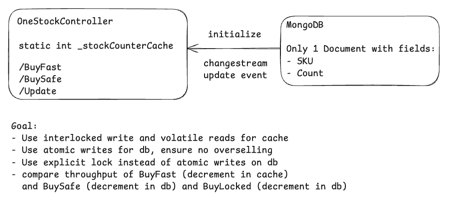
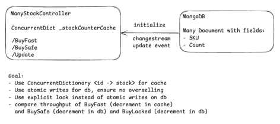
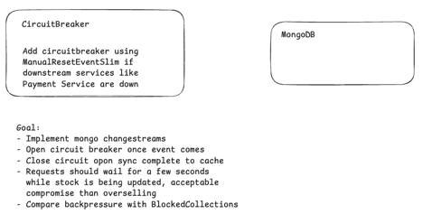

Phase 1

Phase 2

Phase 3

Phase ideas

Here are “bigger-picture” places you’d reach for Interlocked / Volatile—not just code snippets:

Hot-reloadable config / feature flags (snapshot publish)
Build a new immutable config object and Exchange it into place; readers Volatile.Read the latest snapshot without locks. (RCU / copy-on-write.)

In-process leader / ownership
Competing workers attempt CompareExchange(ref ownerThreadId, myId, 0). The winner becomes the single writer; others act as readers.
